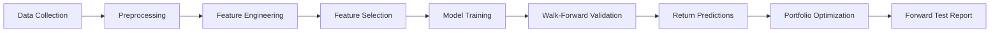
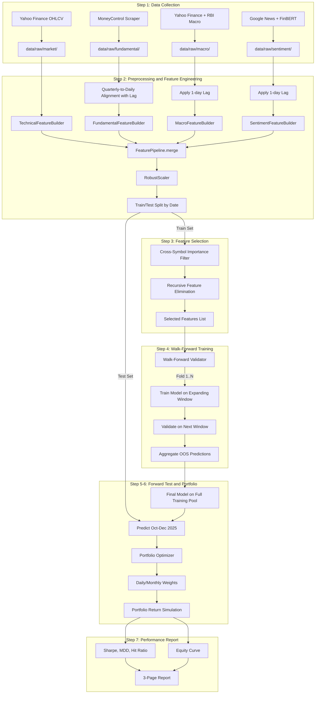
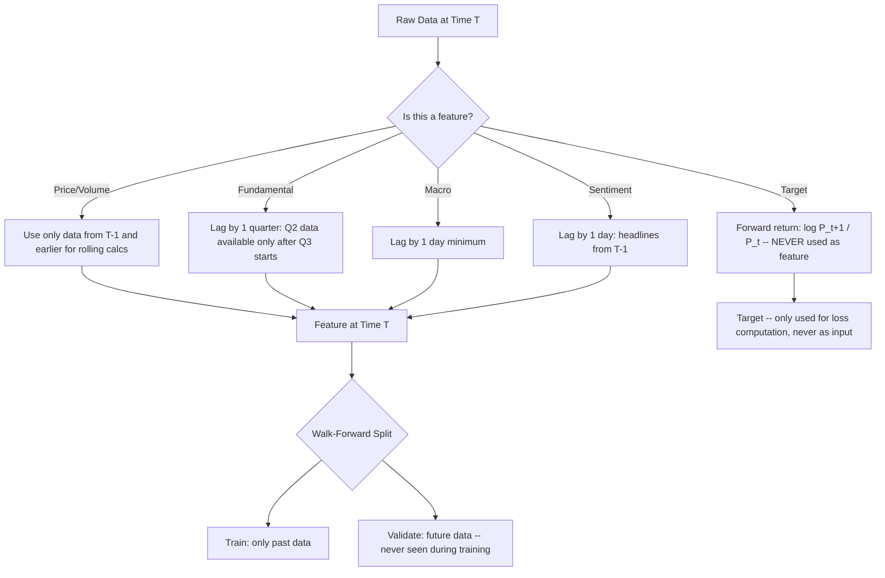
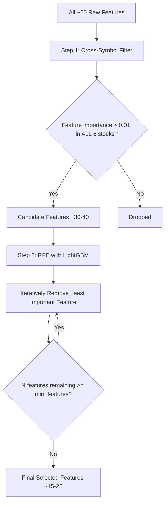
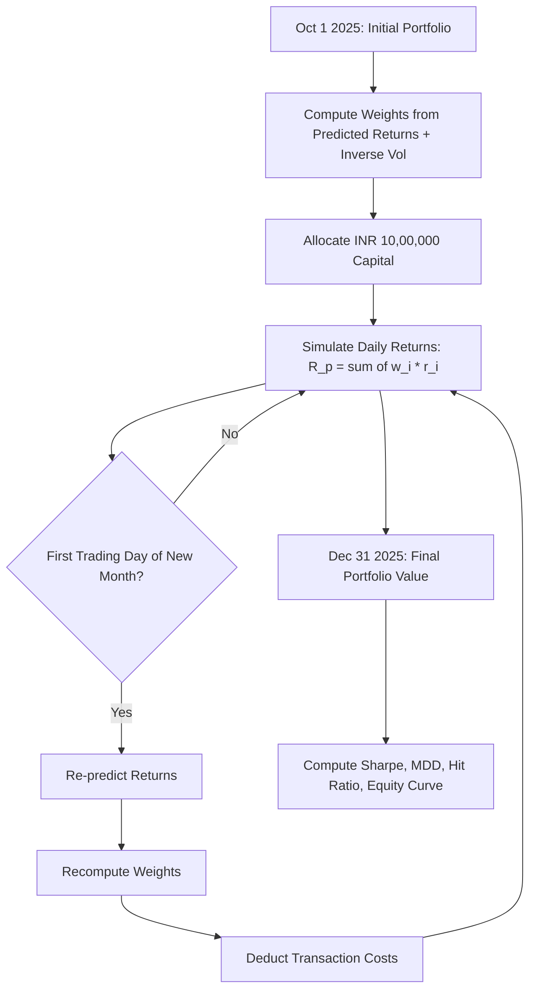
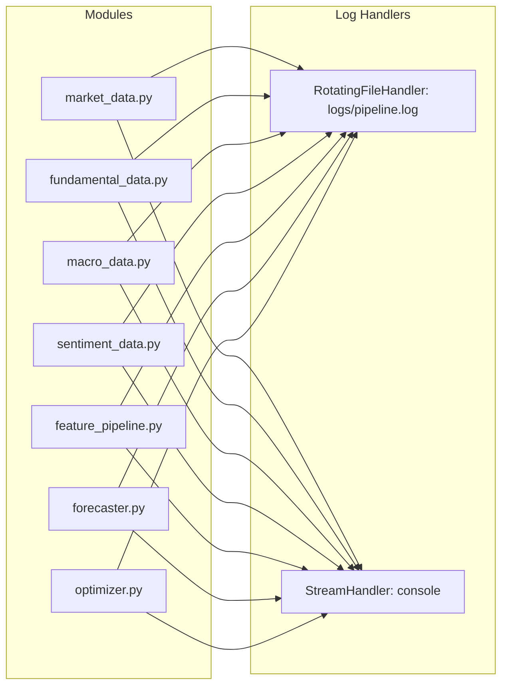
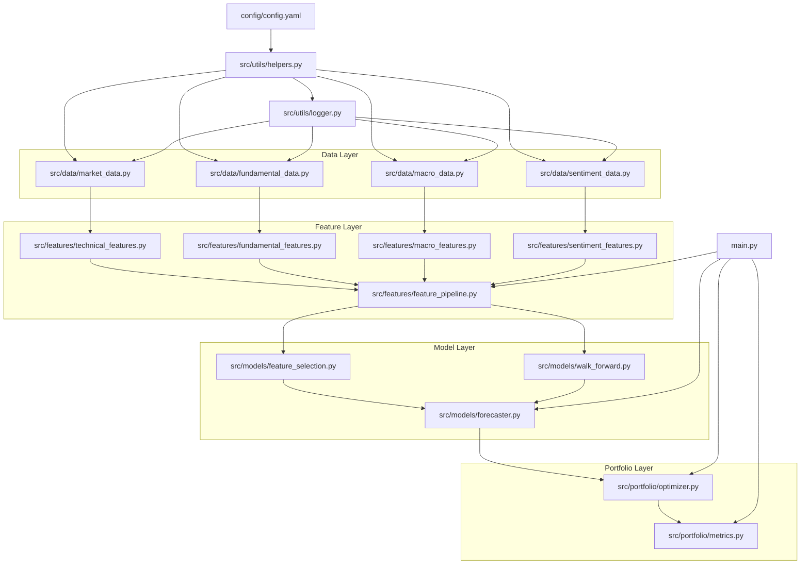

# Architecture Document: Multi-Dimensional Return Forecasting and Portfolio Management

> **Version:** 1.0  
> **Last Updated:** 2026-02-15  
> **Python Version:** 3.10+  
> **Target Platform:** Windows / Linux / macOS

---

## Table of Contents

1. [System Overview](#1-system-overview)
2. [Folder Structure](#2-folder-structure)
3. [Configuration Design](#3-configuration-design)
4. [Component Design](#4-component-design)
5. [Data Flow Architecture](#5-data-flow-architecture)
6. [Model Architecture](#6-model-architecture)
7. [Portfolio Construction Strategy](#7-portfolio-construction-strategy)
8. [Error Handling Strategy](#8-error-handling-strategy)
9. [Testing Strategy](#9-testing-strategy)
10. [Dependency Map](#10-dependency-map)

---

## 1. System Overview

### 1.1 Objective

Build a predictive system for a **6-stock Indian equity universe** that synthesizes structured financial data, unstructured text sentiment, and macroeconomic indicators into a robust ML pipeline to forecast returns and manage a forward-looking portfolio.

### 1.2 Stock Universe

| Ticker       | Yahoo Finance Symbol | Company            |
|-------------|---------------------|--------------------|
| RELIANCE    | RELIANCE.NS         | Reliance Industries |
| HDFCBANK    | HDFCBANK.NS         | HDFC Bank          |
| INFY        | INFY.NS             | Infosys            |
| TAMO        | TATAMOTORS.NS       | Tata Motors        |
| BHARTIARTL  | BHARTIARTL.NS       | Bharti Airtel      |
| HUL         | HINDUNILVR.NS       | Hindustan Unilever |

### 1.3 Time Periods

| Period          | Date Range                | Purpose                    |
|----------------|--------------------------|----------------------------|
| Full History   | Jan 1, 2020 – Dec 31, 2025 | Total data window          |
| Training Pool  | Jan 1, 2020 – Sep 30, 2025 | Walk-forward train/val     |
| Forward Test   | Oct 1, 2025 – Dec 31, 2025 | Held-out final evaluation  |

### 1.4 Critical Constraints

- **No look-ahead bias** — all features at time T use only information available before T
- **Log returns** — no raw prices as model features
- **Robust Scaling** — handles financial outliers in normalization
- **Walk-forward validation only** — K-Fold is strictly prohibited
- **FinBERT** for sentiment analysis
- **Cross-symbol robustness** — stable performance across all 6 tickers

### 1.5 High-Level Pipeline



---

## 2. Folder Structure

```
Assignment02/
├── config/
│   └── config.yaml                    # All configuration parameters
│
├── data/
│   ├── raw/                           # Raw downloaded data
│   │   ├── market/                    # OHLCV CSVs per ticker
│   │   ├── fundamental/               # Quarterly fundamental CSVs
│   │   ├── macro/                     # Macro indicator CSVs
│   │   └── sentiment/                 # Raw news headlines JSON/CSV
│   ├── processed/                     # Cleaned, aligned, merged data
│   │   ├── market_processed.parquet
│   │   ├── fundamental_processed.parquet
│   │   ├── macro_processed.parquet
│   │   └── sentiment_processed.parquet
│   └── features/                      # Final feature matrices
│       ├── features_train.parquet     # Training feature set
│       └── features_test.parquet      # Forward test feature set
│
├── src/
│   ├── __init__.py
│   ├── data/
│   │   ├── __init__.py
│   │   ├── market_data.py             # Yahoo Finance OHLCV fetcher
│   │   ├── fundamental_data.py        # MoneyControl scraper
│   │   ├── macro_data.py              # Macro indicators fetcher
│   │   └── sentiment_data.py          # Google News + FinBERT pipeline
│   ├── features/
│   │   ├── __init__.py
│   │   ├── technical_features.py      # Price-based technical indicators
│   │   ├── fundamental_features.py    # Fundamental ratio features
│   │   ├── macro_features.py          # Macro indicator features
│   │   ├── sentiment_features.py      # Sentiment score features
│   │   └── feature_pipeline.py        # Orchestrates all feature builders
│   ├── models/
│   │   ├── __init__.py
│   │   ├── walk_forward.py            # Walk-forward validation engine
│   │   ├── feature_selection.py       # RFE and feature importance
│   │   └── forecaster.py              # Return prediction models
│   ├── portfolio/
│   │   ├── __init__.py
│   │   ├── optimizer.py               # Portfolio weight optimization
│   │   └── metrics.py                 # Sharpe, MDD, Hit Ratio, Equity Curve
│   └── utils/
│       ├── __init__.py
│       ├── logger.py                  # Logging configuration
│       └── helpers.py                 # Utility functions
│
├── tests/
│   ├── __init__.py
│   ├── test_data.py                   # Data fetcher tests
│   ├── test_features.py               # Feature engineering tests
│   ├── test_models.py                 # Model and validation tests
│   └── test_portfolio.py              # Portfolio optimizer tests
│
├── reports/
│   ├── report_template.md             # 3-page report template
│   └── figures/                       # Generated charts and plots
│       ├── equity_curve.png
│       ├── feature_importance.png
│
├── plans/
│   └── ARCHITECTURE.md                # This document (symlinked or copied)
│
├── main.py                            # Main pipeline orchestrator
├── requirements.txt                   # Python dependencies
├── README.md                          # Project README
└── ARCHITECTURE.md                    # This architecture document
```

### 2.1 Directory Rationale

| Directory | Purpose |
|-----------|---------|
| `config/` | Single source of truth for all tunable parameters, thresholds, and file paths |
| `data/raw/` | Immutable raw data as fetched — never modified after download |
| `data/processed/` | Cleaned, aligned, type-correct intermediate data |
| `data/features/` | Model-ready feature matrices with train/test split |
| `src/data/` | Data acquisition modules — one per source |
| `src/features/` | Feature engineering — one per domain plus orchestrator |
| `src/models/` | ML model training, validation, and feature selection |
| `src/portfolio/` | Portfolio construction, optimization, and metrics |
| `src/utils/` | Cross-cutting concerns: logging, helpers |
| `tests/` | Automated tests mirroring `src/` structure |
| `reports/` | Final deliverable report and generated figures |

---

## 3. Configuration Design

### 3.1 Complete `config.yaml` Structure

```yaml
# ============================================================
# config.yaml — Master Configuration
# ============================================================

project:
  name: "multi-dim-return-forecasting"
  version: "1.0.0"
  random_seed: 42
  n_jobs: -1                          # Parallelism: -1 = all cores

# ------------------------------------------------------------
# Stock Universe
# ------------------------------------------------------------
universe:
  tickers:
    RELIANCE: "RELIANCE.NS"
    HDFCBANK: "HDFCBANK.NS"
    INFY: "INFY.NS"
    TAMO: "TATAMOTORS.NS"
    BHARTIARTL: "BHARTIARTL.NS"
    HUL: "HINDUNILVR.NS"

# ------------------------------------------------------------
# Time Periods
# ------------------------------------------------------------
periods:
  data_start: "2020-01-01"
  data_end: "2025-12-31"
  train_end: "2025-09-30"             # Last day of training pool
  test_start: "2025-10-01"            # First day of forward test
  test_end: "2025-12-31"              # Last day of forward test

# ------------------------------------------------------------
# Data Paths
# ------------------------------------------------------------
paths:
  raw_market: "data/raw/market/"
  raw_fundamental: "data/raw/fundamental/"
  raw_macro: "data/raw/macro/"
  raw_sentiment: "data/raw/sentiment/"
  processed: "data/processed/"
  features: "data/features/"
  reports: "reports/"
  figures: "reports/figures/"
  models: "data/models/"              # Serialized model artifacts

# ------------------------------------------------------------
# Data Sources
# ------------------------------------------------------------
data:
  market:
    source: "yfinance"
    interval: "1d"
    adjust_ohlc: true                 # Use adjusted close
    retry_attempts: 3
    retry_delay_seconds: 5

  fundamental:
    source: "moneycontrol"
    metrics:
      - "pe_ratio"
      - "debt_to_equity"
      - "roe"
      - "eps"
    scrape_delay_seconds: 2           # Politeness delay
    user_agent: "Mozilla/5.0"
    quarterly_alignment: "ffill"      # Forward-fill to daily frequency

  macro:
    indicators:
      usd_inr:
        symbol: "USDINR=X"
        source: "yfinance"
      bond_yield_10y:
        symbol: "^TNX"               # Proxy; replace with India 10Y if available
        source: "yfinance"
      crude_oil:
        symbol: "CL=F"
        source: "yfinance"
      inflation:
        source: "rbi"                # Manual CSV or RBI API
        frequency: "monthly"
        alignment: "ffill"

  sentiment:
    source: "google_news"
    model: "ProsusAI/finbert"
    max_headlines_per_day: 10
    lookback_days: 1                  # Lag for look-ahead bias prevention
    batch_size: 32
    device: "cpu"                     # or "cuda" if GPU available
    scrape_delay_seconds: 1

# ------------------------------------------------------------
# Feature Engineering
# ------------------------------------------------------------
features:
  technical:
    log_return_windows: [1, 5, 10, 21]     # 1d, 1w, 2w, 1m
    volatility_windows: [5, 10, 21]
    sma_windows: [5, 10, 21, 63]
    ema_windows: [5, 10, 21]
    rsi_window: 14
    macd:
      fast: 12
      slow: 26
      signal: 9
    bollinger_window: 20
    bollinger_std: 2.0
    atr_window: 14
    obv: true
    vwap: true

  fundamental:
    lag_quarters: 1                    # Lag by 1 quarter to prevent look-ahead
    features:
      - "pe_ratio"
      - "debt_to_equity"
      - "roe"
      - "eps"
      - "pe_change"                   # Quarter-over-quarter change
      - "eps_growth"

  macro:
    lag_days: 1                        # Minimum 1-day lag
    features:
      - "usd_inr_return"
      - "bond_yield_level"
      - "bond_yield_change"
      - "crude_oil_return"
      - "inflation_rate"

  sentiment:
    lag_days: 1                        # Sentiment from T-1 used at T
    aggregation: "mean"               # mean, median, weighted
    features:
      - "sentiment_score"
      - "sentiment_positive"
      - "sentiment_negative"
      - "sentiment_neutral"
      - "sentiment_score_ma5"         # 5-day moving avg of sentiment

  scaling:
    method: "robust"                   # RobustScaler
    quantile_range: [25.0, 75.0]

  target:
    type: "log_return"
    horizon: 1                         # 1-day forward log return

# ------------------------------------------------------------
# Model Configuration
# ------------------------------------------------------------
model:
  primary: "lightgbm"
  ensemble:
    enabled: true
    models:
      - "lightgbm"
      - "xgboost"
    weights: "equal"                   # or "performance" for weighted avg

  lightgbm:
    objective: "regression"
    metric: "mse"
    n_estimators: 500
    max_depth: 6
    learning_rate: 0.05
    num_leaves: 31
    min_child_samples: 20
    subsample: 0.8
    colsample_bytree: 0.8
    reg_alpha: 0.1                    # L1 regularization
    reg_lambda: 1.0                   # L2 regularization
    early_stopping_rounds: 50
    verbose: -1

  xgboost:
    objective: "reg:squarederror"
    n_estimators: 500
    max_depth: 6
    learning_rate: 0.05
    min_child_weight: 5
    subsample: 0.8
    colsample_bytree: 0.8
    reg_alpha: 0.1
    reg_lambda: 1.0
    early_stopping_rounds: 50

# ------------------------------------------------------------
# Walk-Forward Validation
# ------------------------------------------------------------
validation:
  method: "walk_forward"
  initial_train_days: 504             # ~2 years of trading days
  step_size_days: 63                  # ~3 months (1 quarter)
  min_val_days: 63                    # Minimum validation window
  expanding_window: true              # true = expanding, false = sliding
  purge_days: 5                       # Gap between train and val to prevent leakage

# ------------------------------------------------------------
# Feature Selection
# ------------------------------------------------------------
feature_selection:
  method: "rfe"                        # Recursive Feature Elimination
  estimator: "lightgbm"
  min_features: 10
  max_features: 40
  step: 1                             # Remove 1 feature per iteration
  importance_threshold: 0.01
  cross_symbol_filter: true           # Only keep features important across all stocks

# ------------------------------------------------------------
# Portfolio Construction
# ------------------------------------------------------------
portfolio:
  method: "inverse_volatility"        # inverse_volatility | mean_variance | equal_weight
  rebalance_frequency: "monthly"      # daily | weekly | monthly
  lookback_vol_window: 63             # Days for volatility estimation
  constraints:
    min_weight: 0.05                  # 5% minimum per stock
    max_weight: 0.40                  # 40% maximum per stock
    long_only: true
  risk_free_rate: 0.065               # India ~6.5% risk-free rate (annualized)
  transaction_cost_bps: 10            # 10 basis points round-trip

# ------------------------------------------------------------
# Reporting
# ------------------------------------------------------------
reporting:
  metrics:
    - "sharpe_ratio"
    - "max_drawdown"
    - "hit_ratio"
    - "equity_curve"
    - "annualized_return"
    - "annualized_volatility"
    - "calmar_ratio"
    - "information_ratio"
  figures:
    - "equity_curve"
    - "drawdown_chart"
    - "feature_importance_bar"
    - "weight_allocation_over_time"
    - "prediction_vs_actual_scatter"

# ------------------------------------------------------------
# Logging
# ------------------------------------------------------------
logging:
  level: "INFO"                        # DEBUG | INFO | WARNING | ERROR
  format: "%(asctime)s | %(name)s | %(levelname)s | %(message)s"
  file: "logs/pipeline.log"
  console: true
  rotate_mb: 10
  backup_count: 5
```

---

## 4. Component Design

### 4.1 Data Layer — `src/data/`

#### 4.1.1 `market_data.py` — Market Data Fetcher

**Purpose:** Download and cache OHLCV data for all tickers from Yahoo Finance via `yfinance`.

**Design Pattern:** Repository Pattern — abstracts data source behind a clean interface.

```python
class MarketDataFetcher:
    """Fetches and caches daily OHLCV data from Yahoo Finance."""

    def __init__(self, config: dict) -> None:
        """
        Args:
            config: Parsed config.yaml dictionary.
        """
        ...

    def fetch_single(
        self, ticker: str, start: str, end: str
    ) -> pd.DataFrame:
        """
        Fetch OHLCV for a single ticker.

        Args:
            ticker: Yahoo Finance symbol, e.g. 'RELIANCE.NS'.
            start: Start date 'YYYY-MM-DD'.
            end: End date 'YYYY-MM-DD'.

        Returns:
            DataFrame with columns:
                Date, Open, High, Low, Close, Adj_Close, Volume
            Index: DatetimeIndex.

        Raises:
            DataFetchError: If download fails after retries.
        """
        ...

    def fetch_all(self) -> dict[str, pd.DataFrame]:
        """
        Fetch OHLCV for all tickers in the universe.

        Returns:
            Dict mapping ticker name to its OHLCV DataFrame.
        """
        ...

    def save_raw(self, data: dict[str, pd.DataFrame]) -> None:
        """Persist raw data to data/raw/market/ as CSV files."""
        ...

    def load_raw(self) -> dict[str, pd.DataFrame]:
        """Load previously saved raw market data."""
        ...
```

**Input:** Configuration dict with ticker symbols, date range, retry params.  
**Output:** `dict[str, pd.DataFrame]` — ticker-keyed OHLCV DataFrames.  
**Dependencies:** `yfinance`, `pandas`, `pathlib`.

---

#### 4.1.2 `fundamental_data.py` — Fundamental Data Scraper

**Purpose:** Scrape quarterly fundamental metrics from MoneyControl for each stock.

**Design Pattern:** Adapter Pattern — adapts HTML scraping into a structured DataFrame interface.

```python
class FundamentalDataScraper:
    """Scrapes quarterly fundamental data from MoneyControl."""

    # Mapping from internal ticker to MoneyControl URL slug
    TICKER_URL_MAP: dict[str, str] = {
        "RELIANCE": "reliance-industries-ltd/RI",
        "HDFCBANK": "hdfc-bank-ltd/HDF01",
        "INFY": "infosys-ltd/IT",
        "TAMO": "tata-motors-ltd/TM03",
        "BHARTIARTL": "bharti-airtel-ltd/BA08",
        "HUL": "hindustan-unilever-ltd/HU",
    }

    def __init__(self, config: dict) -> None:
        """
        Args:
            config: Parsed config.yaml dictionary.
        """
        ...

    def scrape_single(self, ticker: str) -> pd.DataFrame:
        """
        Scrape fundamental metrics for one ticker.

        Args:
            ticker: Internal ticker name, e.g. 'RELIANCE'.

        Returns:
            DataFrame with columns:
                quarter_end_date, pe_ratio, debt_to_equity, roe, eps
            Index: DatetimeIndex on quarter_end_date.

        Raises:
            ScrapingError: If page structure changed or request failed.
        """
        ...

    def scrape_all(self) -> dict[str, pd.DataFrame]:
        """Scrape fundamentals for all tickers."""
        ...

    def align_to_daily(
        self,
        fundamental_df: pd.DataFrame,
        daily_dates: pd.DatetimeIndex,
        lag_quarters: int = 1,
    ) -> pd.DataFrame:
        """
        Align quarterly data to daily frequency with appropriate lag.

        Strategy:
            1. Shift quarterly data by `lag_quarters` to prevent look-ahead.
            2. Forward-fill to daily frequency.

        Args:
            fundamental_df: Quarterly fundamental DataFrame.
            daily_dates: Target daily date index.
            lag_quarters: Number of quarters to lag (default: 1).

        Returns:
            Daily-aligned fundamental DataFrame.
        """
        ...

    def save_raw(self, data: dict[str, pd.DataFrame]) -> None:
        """Persist raw fundamental data."""
        ...
```

**Input:** Configuration dict, MoneyControl URLs.  
**Output:** `dict[str, pd.DataFrame]` — quarterly fundamental DataFrames.  
**Dependencies:** `requests`, `beautifulsoup4`, `pandas`, `time`.

---

#### 4.1.3 `macro_data.py` — Macro Indicators Fetcher

**Purpose:** Fetch macroeconomic indicators from Yahoo Finance and RBI.

**Design Pattern:** Strategy Pattern — different fetch strategies per indicator source.

```python
class MacroDataFetcher:
    """Fetches macro indicators: USD-INR, Bond Yields, Crude Oil, Inflation."""

    def __init__(self, config: dict) -> None:
        ...

    def fetch_yfinance_indicator(
        self, symbol: str, name: str, start: str, end: str
    ) -> pd.DataFrame:
        """
        Fetch a single macro indicator from Yahoo Finance.

        Args:
            symbol: Yahoo Finance symbol, e.g. 'USDINR=X'.
            name: Descriptive name for the column.
            start: Start date 'YYYY-MM-DD'.
            end: End date 'YYYY-MM-DD'.

        Returns:
            DataFrame with columns: Date, {name}_close
        """
        ...

    def fetch_rbi_inflation(self) -> pd.DataFrame:
        """
        Load inflation data from RBI CSV or API.

        Returns:
            DataFrame with columns: Date, inflation_rate
            Monthly frequency, to be forward-filled to daily.
        """
        ...

    def fetch_all(self) -> pd.DataFrame:
        """
        Fetch all macro indicators and merge into a single DataFrame.

        Returns:
            DataFrame indexed by Date with all macro indicator columns.
        """
        ...

    def save_raw(self, data: pd.DataFrame) -> None:
        """Persist raw macro data."""
        ...
```

**Input:** Configuration dict with indicator symbols and sources.  
**Output:** `pd.DataFrame` — daily-frequency macro indicators.  
**Dependencies:** `yfinance`, `pandas`, `requests`.

---

#### 4.1.4 `sentiment_data.py` — Sentiment Pipeline

**Purpose:** Fetch financial news headlines and compute sentiment scores using FinBERT.

**Design Pattern:** Pipeline Pattern — sequential stages of fetch → clean → score → aggregate.

```python
class SentimentPipeline:
    """Google News headline scraping + FinBERT sentiment scoring."""

    def __init__(self, config: dict) -> None:
        """
        Initializes the FinBERT model and tokenizer.

        Args:
            config: Parsed config.yaml dictionary.
        """
        ...

    def fetch_headlines(
        self, ticker: str, date: str, max_results: int = 10
    ) -> list[str]:
        """
        Fetch news headlines for a ticker on a given date.

        Args:
            ticker: Company name or ticker for search query.
            date: Target date 'YYYY-MM-DD'.
            max_results: Max headlines to retrieve.

        Returns:
            List of headline strings.
        """
        ...

    def score_headlines(
        self, headlines: list[str]
    ) -> list[dict[str, float]]:
        """
        Score headlines using FinBERT.

        Args:
            headlines: List of headline text strings.

        Returns:
            List of dicts with keys:
                'positive', 'negative', 'neutral', 'label', 'score'
        """
        ...

    def aggregate_daily_sentiment(
        self, scores: list[dict[str, float]]
    ) -> dict[str, float]:
        """
        Aggregate headline-level scores to daily-level.

        Returns:
            Dict with keys:
                'sentiment_score' (positive - negative),
                'sentiment_positive', 'sentiment_negative',
                'sentiment_neutral'
        """
        ...

    def build_sentiment_dataset(
        self,
        ticker: str,
        start_date: str,
        end_date: str,
    ) -> pd.DataFrame:
        """
        Build complete daily sentiment dataset for a ticker.

        Args:
            ticker: Internal ticker name.
            start_date: Start date.
            end_date: End date.

        Returns:
            DataFrame indexed by Date with sentiment columns.
        """
        ...

    def build_all(self) -> dict[str, pd.DataFrame]:
        """Build sentiment datasets for all tickers."""
        ...

    def save_raw(self, data: dict[str, pd.DataFrame]) -> None:
        """Persist raw sentiment data."""
        ...
```

**Input:** Configuration dict with FinBERT model name, search params.  
**Output:** `dict[str, pd.DataFrame]` — daily sentiment DataFrames.  
**Dependencies:** `transformers`, `torch`, `requests`, `beautifulsoup4`, `pandas`.

---

### 4.2 Feature Layer — `src/features/`

#### 4.2.1 `technical_features.py` — Technical Feature Builder

**Purpose:** Compute price-based technical indicators from OHLCV data.

```python
class TechnicalFeatureBuilder:
    """Builds technical indicators from OHLCV market data."""

    def __init__(self, config: dict) -> None:
        ...

    def compute_log_returns(
        self, close: pd.Series, windows: list[int]
    ) -> pd.DataFrame:
        """
        Compute log returns over multiple horizons.

        Args:
            close: Adjusted close price series.
            windows: List of lookback periods, e.g. [1, 5, 10, 21].

        Returns:
            DataFrame with columns: log_ret_{w} for each window w.
        """
        ...

    def compute_volatility(
        self, log_returns_1d: pd.Series, windows: list[int]
    ) -> pd.DataFrame:
        """
        Compute rolling volatility (std of log returns).

        Returns:
            DataFrame with columns: volatility_{w} for each window.
        """
        ...

    def compute_sma(
        self, close: pd.Series, windows: list[int]
    ) -> pd.DataFrame:
        """Simple Moving Averages. Returns ratio of close/SMA."""
        ...

    def compute_ema(
        self, close: pd.Series, windows: list[int]
    ) -> pd.DataFrame:
        """Exponential Moving Averages. Returns ratio of close/EMA."""
        ...

    def compute_rsi(
        self, close: pd.Series, window: int = 14
    ) -> pd.Series:
        """Relative Strength Index."""
        ...

    def compute_macd(
        self, close: pd.Series, fast: int, slow: int, signal: int
    ) -> pd.DataFrame:
        """MACD line, signal line, and histogram."""
        ...

    def compute_bollinger_bands(
        self, close: pd.Series, window: int, num_std: float
    ) -> pd.DataFrame:
        """Bollinger Band width and %B indicator."""
        ...

    def compute_atr(
        self, high: pd.Series, low: pd.Series, close: pd.Series,
        window: int = 14
    ) -> pd.Series:
        """Average True Range."""
        ...

    def compute_obv(
        self, close: pd.Series, volume: pd.Series
    ) -> pd.Series:
        """On-Balance Volume."""
        ...

    def compute_vwap(
        self, high: pd.Series, low: pd.Series, close: pd.Series,
        volume: pd.Series
    ) -> pd.Series:
        """Volume-Weighted Average Price (ratio to close)."""
        ...

    def build(self, ohlcv: pd.DataFrame) -> pd.DataFrame:
        """
        Build all technical features for a single ticker.

        Args:
            ohlcv: OHLCV DataFrame with columns:
                Open, High, Low, Close, Adj_Close, Volume

        Returns:
            DataFrame with all technical feature columns.
            Index: DatetimeIndex.
        """
        ...
```

**Input:** OHLCV DataFrame.  
**Output:** DataFrame with ~30-40 technical feature columns.  
**Dependencies:** `pandas`, `numpy`.

---

#### 4.2.2 `fundamental_features.py` — Fundamental Feature Builder

**Purpose:** Transform aligned quarterly fundamentals into model-ready features.

```python
class FundamentalFeatureBuilder:
    """Builds features from quarterly fundamental data."""

    def __init__(self, config: dict) -> None:
        ...

    def compute_changes(
        self, fundamental_df: pd.DataFrame
    ) -> pd.DataFrame:
        """
        Compute quarter-over-quarter changes for each metric.

        Returns:
            DataFrame with columns: {metric}_change for each metric.
        """
        ...

    def compute_growth_rates(
        self, fundamental_df: pd.DataFrame
    ) -> pd.DataFrame:
        """
        Compute growth rates (percentage change) for EPS, ROE.

        Returns:
            DataFrame with columns: eps_growth, roe_growth.
        """
        ...

    def build(
        self, fundamental_df: pd.DataFrame
    ) -> pd.DataFrame:
        """
        Build all fundamental features.

        Args:
            fundamental_df: Daily-aligned fundamental DataFrame
                (already lagged by FundamentalDataScraper.align_to_daily).

        Returns:
            DataFrame with fundamental feature columns.
        """
        ...
```

**Input:** Daily-aligned fundamental DataFrame (pre-lagged).  
**Output:** DataFrame with ~8-10 fundamental features.  
**Dependencies:** `pandas`, `numpy`.

---

#### 4.2.3 `macro_features.py` — Macro Feature Builder

**Purpose:** Derive features from macroeconomic indicators.

```python
class MacroFeatureBuilder:
    """Builds features from macro indicators."""

    def __init__(self, config: dict) -> None:
        ...

    def compute_returns(
        self, macro_df: pd.DataFrame, columns: list[str]
    ) -> pd.DataFrame:
        """
        Compute log returns for level-based macro indicators.

        Args:
            macro_df: Macro DataFrame with level columns.
            columns: Columns to compute returns for.

        Returns:
            DataFrame with {col}_return columns.
        """
        ...

    def compute_changes(
        self, macro_df: pd.DataFrame, columns: list[str]
    ) -> pd.DataFrame:
        """Compute absolute changes for rate-based indicators."""
        ...

    def apply_lag(
        self, macro_df: pd.DataFrame, lag_days: int
    ) -> pd.DataFrame:
        """
        Lag all macro features by specified days.

        CRITICAL: Prevents look-ahead bias by ensuring macro data
        at time T only uses values from T-lag_days or earlier.
        """
        ...

    def build(self, macro_df: pd.DataFrame) -> pd.DataFrame:
        """Build all macro features with proper lagging."""
        ...
```

**Input:** Daily macro indicator DataFrame.  
**Output:** DataFrame with ~8-12 macro features, lagged.  
**Dependencies:** `pandas`, `numpy`.

---

#### 4.2.4 `sentiment_features.py` — Sentiment Feature Builder

**Purpose:** Derive features from daily sentiment scores.

```python
class SentimentFeatureBuilder:
    """Builds features from daily sentiment scores."""

    def __init__(self, config: dict) -> None:
        ...

    def compute_moving_averages(
        self, sentiment_df: pd.DataFrame, windows: list[int]
    ) -> pd.DataFrame:
        """
        Compute moving averages of sentiment scores.

        Returns:
            DataFrame with sentiment_score_ma{w} columns.
        """
        ...

    def compute_sentiment_momentum(
        self, sentiment_df: pd.DataFrame
    ) -> pd.DataFrame:
        """
        Compute sentiment momentum (change in sentiment).

        Returns:
            DataFrame with sentiment_momentum column.
        """
        ...

    def apply_lag(
        self, sentiment_df: pd.DataFrame, lag_days: int
    ) -> pd.DataFrame:
        """
        Lag sentiment features to prevent look-ahead bias.

        CRITICAL: Sentiment at time T uses headlines from T-1 or earlier.
        """
        ...

    def build(self, sentiment_df: pd.DataFrame) -> pd.DataFrame:
        """Build all sentiment features with proper lagging."""
        ...
```

**Input:** Daily sentiment DataFrame.  
**Output:** DataFrame with ~6-8 sentiment features, lagged.  
**Dependencies:** `pandas`, `numpy`.

---

#### 4.2.5 `feature_pipeline.py` — Feature Pipeline Orchestrator

**Purpose:** Combine all feature builders, apply scaling, produce final feature matrix.

**Design Pattern:** Facade Pattern — simplifies the complex feature-building process into a single interface.

```python
class FeaturePipeline:
    """Orchestrates all feature builders into a unified pipeline."""

    def __init__(self, config: dict) -> None:
        """
        Initializes all sub-builders:
            - TechnicalFeatureBuilder
            - FundamentalFeatureBuilder
            - MacroFeatureBuilder
            - SentimentFeatureBuilder
        """
        ...

    def build_features_single(
        self,
        ticker: str,
        market_data: pd.DataFrame,
        fundamental_data: pd.DataFrame,
        macro_data: pd.DataFrame,
        sentiment_data: pd.DataFrame,
    ) -> pd.DataFrame:
        """
        Build complete feature set for a single ticker.

        Args:
            ticker: Internal ticker name.
            market_data: OHLCV DataFrame.
            fundamental_data: Daily-aligned fundamental DataFrame.
            macro_data: Macro indicator DataFrame.
            sentiment_data: Sentiment DataFrame.

        Returns:
            DataFrame with all features merged on date index.
            NaN rows from rolling windows are dropped.
        """
        ...

    def build_features_all(
        self,
        market_data: dict[str, pd.DataFrame],
        fundamental_data: dict[str, pd.DataFrame],
        macro_data: pd.DataFrame,
        sentiment_data: dict[str, pd.DataFrame],
    ) -> pd.DataFrame:
        """
        Build features for all tickers, stacked vertically.

        Returns:
            DataFrame with columns: ticker, date, feature_1, ..., feature_N, target
            Ready for model training.
        """
        ...

    def compute_target(
        self, close: pd.Series, horizon: int = 1
    ) -> pd.Series:
        """
        Compute forward log return as prediction target.

        target_t = log(close_{t+horizon} / close_t)

        NOTE: Target is shifted forward — the model predicts future returns.
        This is NOT a feature and must not be available at prediction time.
        """
        ...

    def apply_scaling(
        self, features_df: pd.DataFrame, fit: bool = True
    ) -> pd.DataFrame:
        """
        Apply Robust Scaling to feature columns.

        Args:
            features_df: Feature DataFrame (excludes target and metadata cols).
            fit: If True, fit the scaler. If False, use previously fitted scaler.

        Returns:
            Scaled DataFrame.

        Side Effect:
            Stores fitted scaler as self.scaler_ for transform-only use.
        """
        ...

    def split_train_test(
        self, features_df: pd.DataFrame
    ) -> tuple[pd.DataFrame, pd.DataFrame]:
        """
        Split into training pool and forward test set based on config dates.

        Returns:
            Tuple of (train_df, test_df).
        """
        ...

    def save_features(
        self, train_df: pd.DataFrame, test_df: pd.DataFrame
    ) -> None:
        """Save feature matrices to data/features/ as parquet files."""
        ...

    def run(
        self,
        market_data: dict[str, pd.DataFrame],
        fundamental_data: dict[str, pd.DataFrame],
        macro_data: pd.DataFrame,
        sentiment_data: dict[str, pd.DataFrame],
    ) -> tuple[pd.DataFrame, pd.DataFrame]:
        """
        Execute the full feature pipeline.

        Returns:
            Tuple of (train_features, test_features).
        """
        ...
```

**Input:** Raw data dictionaries from all four data sources.  
**Output:** Scaled, split feature matrices as parquet files.  
**Dependencies:** `sklearn.preprocessing.RobustScaler`, `pandas`, `numpy`.

---

### 4.3 Model Layer — `src/models/`

#### 4.3.1 `walk_forward.py` — Walk-Forward Validation Engine

**Purpose:** Implement time-series walk-forward (expanding/sliding window) validation.

**Design Pattern:** Template Method — defines the skeleton of validation; model fitting is delegable.

```python
@dataclass
class WalkForwardSplit:
    """Represents a single train/validation split."""
    fold_id: int
    train_start: pd.Timestamp
    train_end: pd.Timestamp
    val_start: pd.Timestamp
    val_end: pd.Timestamp


class WalkForwardValidator:
    """
    Walk-forward cross-validation for time series.

    Supports:
        - Expanding window (growing training set)
        - Sliding window (fixed training set size)
        - Purge gap between train and validation
    """

    def __init__(self, config: dict) -> None:
        """
        Args:
            config: Validation section of config.yaml with:
                initial_train_days, step_size_days, min_val_days,
                expanding_window, purge_days.
        """
        ...

    def generate_splits(
        self, dates: pd.DatetimeIndex
    ) -> list[WalkForwardSplit]:
        """
        Generate walk-forward train/validation date ranges.

        The purge gap of `purge_days` is inserted between the end of
        training and the start of validation to prevent data leakage
        from overlapping windows or feature lag effects.

        Args:
            dates: Sorted DatetimeIndex of all available dates.

        Returns:
            List of WalkForwardSplit objects.

        Example with expanding window:
            Fold 0: Train [0..504], Purge [505..509], Val [510..572]
            Fold 1: Train [0..572], Purge [573..577], Val [578..640]
            ...
        """
        ...

    def run_validation(
        self,
        features_df: pd.DataFrame,
        model_factory: callable,
        feature_cols: list[str],
        target_col: str = "target",
    ) -> dict:
        """
        Execute walk-forward validation.

        Args:
            features_df: Full training pool DataFrame with ticker column.
            model_factory: Callable that returns a fresh model instance.
            feature_cols: List of feature column names.
            target_col: Name of the target column.

        Returns:
            Dict with keys:
                'fold_metrics': list of per-fold metric dicts
                'predictions': DataFrame of out-of-sample predictions
                'avg_metrics': dict of averaged metrics across folds
        """
        ...

    def _evaluate_fold(
        self,
        y_true: np.ndarray,
        y_pred: np.ndarray,
    ) -> dict[str, float]:
        """
        Compute metrics for a single fold.

        Returns:
            Dict with: mse, rmse, mae, directional_accuracy, ic
            (information coefficient = correlation).
        """
        ...
```

**Input:** Feature DataFrame, model factory function, config params.  
**Output:** Fold-level and aggregated validation metrics, OOS predictions.  
**Dependencies:** `pandas`, `numpy`, `sklearn.metrics`.

---

#### 4.3.2 `feature_selection.py` — Feature Selection Module

**Purpose:** Select the most predictive features while preventing overfitting.

```python
class FeatureSelector:
    """
    Feature selection using Recursive Feature Elimination
    with cross-symbol robustness filtering.
    """

    def __init__(self, config: dict) -> None:
        ...

    def run_rfe(
        self,
        X: pd.DataFrame,
        y: pd.Series,
        estimator: object,
        n_features_to_select: int,
    ) -> list[str]:
        """
        Run Recursive Feature Elimination.

        Args:
            X: Feature matrix.
            y: Target vector.
            estimator: Sklearn-compatible estimator with feature_importances_.
            n_features_to_select: Target number of features.

        Returns:
            List of selected feature names.
        """
        ...

    def compute_feature_importance(
        self,
        model: object,
        feature_names: list[str],
    ) -> pd.DataFrame:
        """
        Extract and rank feature importances from a fitted model.

        Returns:
            DataFrame with columns: feature, importance
            Sorted by importance descending.
        """
        ...

    def cross_symbol_filter(
        self,
        features_df: pd.DataFrame,
        tickers: list[str],
        target_col: str = "target",
        min_importance: float = 0.01,
    ) -> list[str]:
        """
        Filter features that are important across ALL tickers.

        Strategy:
            1. Fit a model per ticker on its data.
            2. Compute feature importances per ticker.
            3. Keep only features above min_importance in ALL tickers.

        This prevents over-tuning to a single high-beta stock.

        Returns:
            List of cross-symbol robust feature names.
        """
        ...

    def select(
        self,
        features_df: pd.DataFrame,
        target_col: str = "target",
    ) -> list[str]:
        """
        Full feature selection pipeline:
            1. Cross-symbol importance filter.
            2. RFE on the filtered feature set.

        Returns:
            Final list of selected feature names.
        """
        ...
```

**Input:** Feature DataFrame with all tickers stacked.  
**Output:** List of selected feature names.  
**Dependencies:** `sklearn.feature_selection.RFE`, `lightgbm`, `pandas`.

---

#### 4.3.3 `forecaster.py` — Return Prediction Model

**Purpose:** Train, predict, and persist return forecasting models.

```python
class ReturnForecaster:
    """
    Manages model training, prediction, and persistence
    for stock return forecasting.
    """

    def __init__(self, config: dict) -> None:
        """
        Args:
            config: Model section of config.yaml.
        """
        ...

    def create_model(self, model_type: str = "lightgbm") -> object:
        """
        Factory method to create a fresh model instance.

        Args:
            model_type: One of 'lightgbm', 'xgboost'.

        Returns:
            Unfitted sklearn-compatible estimator.
        """
        ...

    def train(
        self,
        X_train: pd.DataFrame,
        y_train: pd.Series,
        X_val: pd.DataFrame | None = None,
        y_val: pd.Series | None = None,
    ) -> object:
        """
        Train a model with optional early stopping.

        Args:
            X_train: Training features.
            y_train: Training targets.
            X_val: Validation features for early stopping.
            y_val: Validation targets for early stopping.

        Returns:
            Fitted model object.
        """
        ...

    def predict(
        self, model: object, X: pd.DataFrame
    ) -> np.ndarray:
        """
        Generate return predictions.

        Args:
            model: Fitted model.
            X: Feature DataFrame.

        Returns:
            Array of predicted log returns.
        """
        ...

    def train_ensemble(
        self,
        X_train: pd.DataFrame,
        y_train: pd.Series,
        X_val: pd.DataFrame | None = None,
        y_val: pd.Series | None = None,
    ) -> list[object]:
        """
        Train an ensemble of models (LightGBM + XGBoost).

        Returns:
            List of fitted model objects.
        """
        ...

    def predict_ensemble(
        self,
        models: list[object],
        X: pd.DataFrame,
        weights: str = "equal",
    ) -> np.ndarray:
        """
        Generate ensemble predictions.

        Args:
            models: List of fitted models.
            X: Feature DataFrame.
            weights: 'equal' for simple average,
                     'performance' for validation-weighted.

        Returns:
            Array of ensembled predicted log returns.
        """
        ...

    def save_model(
        self, model: object, path: str
    ) -> None:
        """Serialize model to disk using joblib."""
        ...

    def load_model(self, path: str) -> object:
        """Deserialize model from disk."""
        ...
```

**Input:** Feature matrices, model configuration.  
**Output:** Fitted models, predicted log returns.  
**Dependencies:** `lightgbm`, `xgboost`, `joblib`, `numpy`, `pandas`.

---

### 4.4 Portfolio Layer — `src/portfolio/`

#### 4.4.1 `optimizer.py` — Portfolio Weight Optimizer

**Purpose:** Compute optimal portfolio weights from predicted returns and risk estimates.

```python
class PortfolioOptimizer:
    """
    Portfolio weight optimization supporting multiple strategies:
        - Inverse Volatility
        - Mean-Variance Optimization
        - Equal Weight (baseline)
    """

    def __init__(self, config: dict) -> None:
        ...

    def inverse_volatility_weights(
        self, returns: pd.DataFrame, lookback: int = 63
    ) -> pd.Series:
        """
        Compute weights inversely proportional to recent volatility.

        Args:
            returns: DataFrame of log returns, columns = tickers.
            lookback: Rolling window for volatility estimation.

        Returns:
            Series mapping ticker to weight, summing to 1.0.
        """
        ...

    def mean_variance_weights(
        self,
        predicted_returns: pd.Series,
        cov_matrix: pd.DataFrame,
        risk_free_rate: float = 0.065,
    ) -> pd.Series:
        """
        Mean-variance optimization (maximize Sharpe ratio).

        Args:
            predicted_returns: Expected returns per ticker.
            cov_matrix: Covariance matrix of returns.
            risk_free_rate: Annualized risk-free rate.

        Returns:
            Series mapping ticker to weight.
        """
        ...

    def equal_weights(self, tickers: list[str]) -> pd.Series:
        """Uniform 1/N allocation."""
        ...

    def apply_constraints(
        self, weights: pd.Series
    ) -> pd.Series:
        """
        Apply portfolio constraints from config:
            - min_weight: Minimum allocation per stock.
            - max_weight: Maximum allocation per stock.
            - long_only: No short positions.

        Rescales to sum to 1.0 after applying constraints.
        """
        ...

    def compute_weights(
        self,
        predicted_returns: pd.Series,
        historical_returns: pd.DataFrame,
        method: str = "inverse_volatility",
    ) -> pd.Series:
        """
        Compute portfolio weights using the specified method.

        Args:
            predicted_returns: Model predicted returns per ticker.
            historical_returns: Historical return DataFrame.
            method: One of 'inverse_volatility', 'mean_variance', 'equal_weight'.

        Returns:
            Constrained weight Series.
        """
        ...

    def rebalance_schedule(
        self, dates: pd.DatetimeIndex, frequency: str = "monthly"
    ) -> list[pd.Timestamp]:
        """
        Generate rebalancing dates.

        Args:
            dates: Full date range.
            frequency: 'daily', 'weekly', 'monthly'.

        Returns:
            List of dates when portfolio is rebalanced.
        """
        ...
```

**Input:** Predicted returns, historical return data, config constraints.  
**Output:** Constrained portfolio weight Series.  
**Dependencies:** `scipy.optimize`, `pandas`, `numpy`.

---

#### 4.4.2 `metrics.py` — Portfolio Performance Metrics

**Purpose:** Compute all required portfolio and model performance metrics.

```python
class PortfolioMetrics:
    """Computes portfolio and model performance metrics."""

    def __init__(self, risk_free_rate: float = 0.065) -> None:
        ...

    def sharpe_ratio(
        self,
        returns: pd.Series,
        annualize: bool = True,
        trading_days: int = 252,
    ) -> float:
        """
        Compute annualized Sharpe ratio.

        Sharpe = (mean_return - risk_free_daily) / std_return * sqrt(252)
        """
        ...

    def max_drawdown(
        self, returns: pd.Series
    ) -> float:
        """
        Compute maximum drawdown from peak.

        Returns:
            Float in range [-1, 0] representing max peak-to-trough decline.
        """
        ...

    def hit_ratio(
        self,
        predicted_returns: pd.Series,
        actual_returns: pd.Series,
    ) -> float:
        """
        Compute directional accuracy (hit ratio).

        Hit Ratio = fraction of days where sign(predicted) == sign(actual)
        """
        ...

    def equity_curve(
        self,
        returns: pd.Series,
        initial_capital: float = 1_000_000.0,
    ) -> pd.Series:
        """
        Compute cumulative equity curve.

        Returns:
            Series of portfolio values over time.
        """
        ...

    def annualized_return(
        self, returns: pd.Series, trading_days: int = 252
    ) -> float:
        """Compute annualized return."""
        ...

    def annualized_volatility(
        self, returns: pd.Series, trading_days: int = 252
    ) -> float:
        """Compute annualized volatility."""
        ...

    def calmar_ratio(self, returns: pd.Series) -> float:
        """Calmar Ratio = Annualized Return / |Max Drawdown|."""
        ...

    def information_ratio(
        self,
        portfolio_returns: pd.Series,
        benchmark_returns: pd.Series,
    ) -> float:
        """
        Information Ratio = (R_p - R_b) / tracking_error.
        """
        ...

    def compute_all(
        self,
        portfolio_returns: pd.Series,
        predicted_returns: pd.Series,
        actual_returns: pd.Series,
        benchmark_returns: pd.Series | None = None,
    ) -> dict[str, float]:
        """
        Compute all metrics in one call.

        Returns:
            Dict with all metric names and values.
        """
        ...

    def generate_report(
        self,
        metrics: dict[str, float],
        equity_curve: pd.Series,
        output_dir: str,
    ) -> None:
        """
        Generate performance report with charts.

        Saves:
            - equity_curve.png
            - drawdown_chart.png
            - metrics summary to CSV
        """
        ...
```

**Input:** Portfolio returns, predictions, actuals.  
**Output:** Performance metric dict, equity curve, charts.  
**Dependencies:** `pandas`, `numpy`, `matplotlib`.

---

### 4.5 Utilities — `src/utils/`

#### 4.5.1 `logger.py` — Logging Configuration

```python
def setup_logger(
    name: str,
    config: dict,
) -> logging.Logger:
    """
    Configure and return a logger with file + console handlers.

    Args:
        name: Logger name (typically __name__ of calling module).
        config: Logging section of config.yaml.

    Returns:
        Configured Logger instance with:
            - RotatingFileHandler (logs/pipeline.log)
            - StreamHandler (console)
    """
    ...
```

#### 4.5.2 `helpers.py` — Utility Functions

```python
def load_config(path: str = "config/config.yaml") -> dict:
    """Load and parse YAML config file."""
    ...

def ensure_dirs(config: dict) -> None:
    """Create all required directories from config paths."""
    ...

def set_seed(seed: int) -> None:
    """Set random seed for reproducibility across numpy, random, torch."""
    ...

def trading_days_between(
    start: str, end: str
) -> pd.DatetimeIndex:
    """
    Generate trading day index for NSE using pandas market calendars.
    Falls back to business days if calendar unavailable.
    """
    ...
```

---

### 4.6 Pipeline Orchestrator — `main.py`

**Purpose:** End-to-end pipeline execution — from data fetch to final report.

```python
class Pipeline:
    """Main pipeline orchestrator."""

    def __init__(self, config_path: str = "config/config.yaml") -> None:
        ...

    def step_1_fetch_data(self) -> None:
        """Fetch all raw data from all sources."""
        ...

    def step_2_build_features(self) -> None:
        """Build and save feature matrices."""
        ...

    def step_3_select_features(self) -> None:
        """Run feature selection on training data."""
        ...

    def step_4_train_model(self) -> None:
        """Train model with walk-forward validation."""
        ...

    def step_5_forward_test(self) -> None:
        """Generate predictions on held-out test set."""
        ...

    def step_6_build_portfolio(self) -> None:
        """Construct portfolio and simulate forward test period."""
        ...

    def step_7_report(self) -> None:
        """Compute metrics and generate final report."""
        ...

    def run(self, start_step: int = 1) -> None:
        """
        Execute the full pipeline.

        Args:
            start_step: Step to resume from (1-7).
                Allows resuming after failures.
        """
        ...


if __name__ == "__main__":
    import argparse

    parser = argparse.ArgumentParser(
        description="Multi-Dimensional Return Forecasting Pipeline"
    )
    parser.add_argument(
        "--config", default="config/config.yaml", help="Path to config file"
    )
    parser.add_argument(
        "--step", type=int, default=1, help="Step to start from (1-7)"
    )
    args = parser.parse_args()

    pipeline = Pipeline(config_path=args.config)
    pipeline.run(start_step=args.step)
```

---

## 5. Data Flow Architecture

### 5.1 End-to-End Pipeline Flow



### 5.2 Data Transformation Stages

| Stage | Input | Transformation | Output |
|-------|-------|---------------|--------|
| Raw Fetch | API/Scrape | Download and cache | CSV/JSON per source |
| Alignment | Quarterly fundamentals | Lag by 1 quarter + forward-fill | Daily frequency DataFrame |
| Log Returns | Adjusted Close prices | `log(P_t / P_{t-1})` | Stationary return series |
| Technical | OHLCV | Rolling window calculations | ~30-40 indicator columns |
| Macro Lag | Daily macro levels | Shift by 1+ days | Lagged macro features |
| Sentiment Lag | Daily sentiment scores | Shift by 1 day | Lagged sentiment features |
| Merge | All feature DataFrames | Inner join on date | Unified feature matrix |
| Scaling | Merged features | RobustScaler fit/transform | Normalized features |
| Target | Adj Close | `log(P_{t+1} / P_t)` | Forward 1-day log return |
| Split | Scaled features + target | Date-based cutoff at 2025-09-30 | Train and test sets |

### 5.3 Look-Ahead Bias Prevention

This is the most critical architectural concern. The following measures are implemented at each stage:



**Specific safeguards:**

| Data Type | Bias Risk | Prevention Method |
|-----------|-----------|-------------------|
| OHLCV Features | Rolling windows include T | Use `shift(1)` before rolling OR compute returns as `log(P_t / P_{t-1})` where feature at T uses P at T and T-1 — both available at T |
| Fundamental | Quarterly data published after quarter end | Lag by 1 full quarter: Q1 data available only from Q2 start onwards |
| Macro Indicators | Same-day data might not be available | Lag by 1 trading day |
| Sentiment | Headlines from today might not be processed in time | Use T-1 headlines at time T |
| Target Variable | Forward return is by definition future data | Never included in feature matrix; only used for loss computation |
| Scaling | Scaler fitted on future data | Fit scaler ONLY on training data; transform test data |
| Feature Selection | Selection informed by test data | RFE runs only on training pool |
| Walk-Forward Splits | Train/val overlap | Purge gap of 5 days between train end and val start |

---

## 6. Model Architecture

### 6.1 Model Selection Rationale

**Primary Model: LightGBM**

| Criterion | LightGBM Advantage |
|-----------|-------------------|
| Speed | Histogram-based splitting is 10-20x faster than traditional GBDT |
| Handling of financial data | Native support for missing values, outliers |
| Feature interactions | Automatic discovery of non-linear relationships |
| Regularization | Built-in L1/L2, max_depth, min_child_samples |
| Overfitting control | Early stopping, subsample, colsample_bytree |
| Feature importance | Direct access to split-based and gain-based importance |

**Secondary Model: XGBoost** — for ensemble diversity.

**Ensemble Strategy:**
- Train both LightGBM and XGBoost independently.
- Combine predictions via simple average (equal weights) or validation-performance-weighted average.
- Ensemble typically reduces variance and improves robustness.

### 6.2 Walk-Forward Validation Design

**Expanding Window Configuration:**

| Parameter | Value | Rationale |
|-----------|-------|-----------|
| Initial Training Window | 504 trading days (~2 years) | Sufficient data for LightGBM to learn patterns |
| Step Size | 63 trading days (~1 quarter) | Aligns with quarterly fundamental data updates |
| Minimum Validation Window | 63 trading days (~1 quarter) | Statistically meaningful evaluation period |
| Purge Gap | 5 trading days | Prevents leakage from feature lag effects |
| Expanding Window | Yes | Growing training set captures evolving market regimes |

**Fold Structure Example:**

```
Timeline: 2020-01 ──────────────────────────────────────────── 2025-09

Fold 0: [====== TRAIN 504d ======][P][ VAL 63d ]
Fold 1: [========== TRAIN 567d =========][P][ VAL 63d ]
Fold 2: [============== TRAIN 630d =============][P][ VAL 63d ]
Fold 3: [================== TRAIN 693d ================][P][ VAL 63d ]
  ...
Fold N: [========================= TRAIN expanding ======================][P][ VAL 63d ]

[P] = 5-day purge gap
```

**Expected number of folds:** approximately 14-16 folds covering Jan 2020 – Sep 2025.

### 6.3 Feature Selection Strategy



**Two-Stage Selection Process:**

1. **Cross-Symbol Importance Filter:**
   - Train a LightGBM model independently for each of the 6 tickers.
   - Compute gain-based feature importance for each model.
   - Normalize importances to sum to 1.0 per ticker.
   - **Keep only** features with importance ≥ 0.01 in **all 6 tickers**.
   - This eliminates ticker-specific noise features.

2. **Recursive Feature Elimination:**
   - Using the cross-symbol-filtered feature set, run RFE on the pooled dataset (all tickers stacked).
   - Use LightGBM as the RFE estimator.
   - Remove 1 feature per iteration (conservative).
   - Stop when reaching `min_features` (10) or when validation performance degrades.
   - Target: 15-25 final features.

### 6.4 Hyperparameter Tuning Approach

**Strategy: Conservative defaults + walk-forward-aware tuning.**

Rather than expensive grid/random search, the architecture recommends:

1. **Start with well-tested defaults** (provided in config.yaml).
2. **Tune only high-impact parameters** within walk-forward validation:
   - `n_estimators` → controlled by early stopping (set high, let early stopping decide)
   - `learning_rate` → try {0.01, 0.05, 0.1}
   - `max_depth` → try {4, 6, 8}
   - `num_leaves` → try {15, 31, 63}
   - `reg_alpha` / `reg_lambda` → try {0.01, 0.1, 1.0}

3. **Tuning protocol:**
   - For each hyperparameter combination, run full walk-forward validation.
   - Select the combination with the best average IC (Information Coefficient) across folds.
   - Verify that the same combination performs well across all 6 tickers (no single-stock overfitting).

4. **Overfitting safeguards during tuning:**
   - Early stopping on validation set within each fold.
   - Monitor train-vs-validation metric gap; flag if gap > 2x.
   - Prefer simpler models (lower depth, higher regularization) when performance is similar.

### 6.5 Cross-Symbol Training Strategy

**Two viable approaches — recommend Option A:**

**Option A: Pooled Model (Recommended)**
- Stack all 6 tickers' data vertically into a single training set.
- Add a `ticker` one-hot encoding or leave-one-out encoding as a feature.
- Train a single model that learns shared patterns across all stocks.
- **Advantage:** More training data, better generalization, single model to maintain.
- **Risk:** High-beta stocks (TAMO) may dominate; mitigated by cross-symbol feature selection.

**Option B: Per-Ticker Models**
- Train 6 independent models, one per ticker.
- **Advantage:** Ticker-specific patterns captured.
- **Risk:** Less data per model, higher overfitting risk, 6 models to maintain.

**Robustness Verification:**
- After training, evaluate the model separately on each ticker.
- Report per-ticker metrics (IC, directional accuracy, Sharpe).
- Flag any ticker where performance deviates more than 1 standard deviation from the mean.
- If TAMO or any single stock dominates performance, apply sample weighting to equalize.

---

## 7. Portfolio Construction Strategy

### 7.1 Weight Optimization Method

**Primary: Inverse Volatility Weighting**

This method allocates more capital to lower-volatility stocks, acting as a natural risk management mechanism.

```
w_i = (1 / sigma_i) / sum(1 / sigma_j)  for all j in universe
```

Where `sigma_i` is the rolling 63-day realized volatility of stock `i`.

**Why Inverse Volatility over Mean-Variance:**

| Factor | Inverse Volatility | Mean-Variance |
|--------|-------------------|---------------|
| Sensitivity to return estimates | None — uses only volatility | Highly sensitive to noisy return predictions |
| Stability | Very stable weights | Can produce extreme weights |
| Implementation complexity | Simple | Requires covariance matrix estimation + optimization |
| Robustness to prediction errors | High — degrades gracefully | Low — garbage-in-garbage-out |
| Theoretical backing | Risk parity foundation | Markowitz framework |

**Alternative (for comparison):** Mean-variance optimization is also implemented as an option. The report should compare both approaches.

### 7.2 Signal Integration with Weights

While inverse volatility determines base weights, the model's return predictions are integrated as follows:

1. **Compute base weights** from inverse volatility.
2. **Apply signal tilt:** Increase weight for stocks with positive predicted returns, decrease for negative.
   ```
   w_tilted_i = w_base_i * (1 + alpha * predicted_return_i)
   ```
   Where `alpha` is a signal strength parameter (default: 1.0).
3. **Re-normalize** to sum to 1.0.
4. **Apply constraints** (min 5%, max 40%, long-only).

### 7.3 Rebalancing Frequency

**Monthly rebalancing** (first trading day of each month).

| Frequency | Pros | Cons |
|-----------|------|------|
| Daily | Maximizes signal usage | High transaction costs, turnover |
| Weekly | Balanced | Moderate costs |
| **Monthly** | **Low costs, stable** | **Some signal decay** |

For the 3-month forward test (Oct-Dec 2025), this means **3 rebalancing events**.

### 7.4 Risk Management

| Control | Implementation |
|---------|---------------|
| Position Limits | Min 5%, Max 40% per stock |
| Long-Only | No short positions |
| Transaction Costs | 10 bps round-trip deducted at rebalance |
| Concentration Risk | Max 40% prevents single-stock dominance |
| Volatility Targeting | Inverse volatility inherently controls risk |

### 7.5 Forward Test Simulation



---

## 8. Error Handling Strategy

### 8.1 Logging Architecture



**Log Levels by Stage:**

| Stage | Default Level | Critical Events at ERROR |
|-------|--------------|--------------------------|
| Data Fetch | INFO | API failures, missing tickers, timeout |
| Scraping | INFO | Page structure changes, HTTP errors |
| Feature Engineering | DEBUG | NaN counts, feature statistics |
| Model Training | INFO | Training divergence, early stopping triggers |
| Portfolio | INFO | Weight constraint violations, negative weights |
| Pipeline | INFO | Step failures, checkpoint saves |

### 8.2 Custom Exception Hierarchy

```python
class PipelineError(Exception):
    """Base exception for the pipeline."""
    pass

class DataFetchError(PipelineError):
    """Raised when data fetching fails after retries."""
    pass

class ScrapingError(PipelineError):
    """Raised when web scraping fails."""
    pass

class DataValidationError(PipelineError):
    """Raised when data fails quality checks."""
    pass

class ModelTrainingError(PipelineError):
    """Raised when model training fails."""
    pass

class PortfolioError(PipelineError):
    """Raised when portfolio construction fails."""
    pass
```

### 8.3 Data Validation Checks

Applied automatically at each data processing boundary:

```python
class DataValidator:
    """Validates data quality at pipeline boundaries."""

    @staticmethod
    def validate_ohlcv(df: pd.DataFrame, ticker: str) -> None:
        """
        Checks:
            - No missing dates in trading calendar
            - Close > 0 for all rows
            - Volume >= 0
            - High >= Low
            - No duplicate dates
            - Date range matches config

        Raises:
            DataValidationError with descriptive message.
        """
        ...

    @staticmethod
    def validate_features(df: pd.DataFrame) -> None:
        """
        Checks:
            - NaN percentage < 5% per column
            - No infinite values
            - No constant columns (zero variance)
            - Feature count within expected range

        Raises:
            DataValidationError with descriptive message.
        """
        ...

    @staticmethod
    def validate_no_lookahead(
        features_df: pd.DataFrame,
        target_col: str = "target",
    ) -> None:
        """
        Statistical check for look-ahead bias:
            - Correlation between features and FUTURE target is suspicious
              if much higher than with CURRENT target.
            - Flag any feature with abs correlation > 0.5 with forward target.

        Raises:
            DataValidationError if suspected look-ahead bias.
        """
        ...
```

### 8.4 Graceful Degradation

When a data source fails, the pipeline should degrade gracefully rather than crash:

| Failure Scenario | Graceful Response |
|-----------------|-------------------|
| MoneyControl scraping fails for 1 ticker | Use last known fundamental values; log WARNING; continue |
| MoneyControl scraping fails completely | Skip fundamental features; train model on remaining features; log ERROR |
| Google News returns no headlines for a date | Fill sentiment with neutral (0.0) for that date; log WARNING |
| FinBERT model fails to load | Skip sentiment features entirely; log ERROR |
| Single Yahoo Finance ticker fails | Retry 3x; if still fails, exclude ticker from universe; log ERROR |
| RBI inflation data unavailable | Use last known value with forward-fill; log WARNING |
| Walk-forward fold has too few samples | Skip that fold; log WARNING |

**Implementation:** Each data fetcher wraps its core logic in a try/except block, logs the error, and returns a fallback value (empty DataFrame or default values).

### 8.5 Checkpointing

The pipeline supports resumable execution via step-based checkpointing:

1. After each major step (1-7), intermediate results are saved to disk.
2. `main.py --step N` resumes from step N, loading prior results from disk.
3. This prevents re-fetching data or re-training after a late-stage failure.

---

## 9. Testing Strategy

### 9.1 Test Structure

```
tests/
├── __init__.py
├── test_data.py          # Data fetcher tests
├── test_features.py      # Feature engineering tests
├── test_models.py        # Model and validation tests
├── test_portfolio.py     # Portfolio optimizer tests
└── conftest.py           # Shared fixtures
```

### 9.2 Unit Tests — `test_data.py`

```python
class TestMarketDataFetcher:
    """Tests for MarketDataFetcher."""

    def test_fetch_single_returns_dataframe(self):
        """Verify fetch returns a DataFrame with expected columns."""
        ...

    def test_fetch_single_date_range(self):
        """Verify returned data falls within requested date range."""
        ...

    def test_fetch_single_no_missing_columns(self):
        """Verify all OHLCV columns are present."""
        ...

    def test_fetch_all_returns_all_tickers(self):
        """Verify all 6 tickers are fetched."""
        ...

    def test_save_and_load_raw_roundtrip(self):
        """Verify data survives save/load cycle."""
        ...


class TestFundamentalDataScraper:
    """Tests for FundamentalDataScraper."""

    def test_align_to_daily_produces_daily_frequency(self):
        """Verify quarterly data is expanded to daily."""
        ...

    def test_align_to_daily_applies_lag(self):
        """Verify fundamental data is lagged by 1 quarter."""
        ...

    def test_align_to_daily_no_future_data(self):
        """
        CRITICAL: Verify no look-ahead bias.
        Q1 2024 data should NOT appear before Q2 2024 start date.
        """
        ...


class TestSentimentPipeline:
    """Tests for SentimentPipeline."""

    def test_score_headlines_returns_valid_scores(self):
        """Verify FinBERT returns scores in valid range."""
        ...

    def test_aggregate_daily_sentiment_range(self):
        """Verify aggregated sentiment is in [-1, 1]."""
        ...
```

### 9.3 Unit Tests — `test_features.py`

```python
class TestTechnicalFeatureBuilder:
    """Tests for TechnicalFeatureBuilder."""

    def test_log_returns_correctness(self):
        """Verify log returns match manual calculation."""
        ...

    def test_log_returns_no_lookahead(self):
        """Verify return at T uses only price at T and T-1."""
        ...

    def test_rsi_range(self):
        """Verify RSI is in [0, 100]."""
        ...

    def test_bollinger_band_width_positive(self):
        """Verify band width is always positive."""
        ...

    def test_build_no_nans_after_warmup(self):
        """Verify no NaN values after rolling window warm-up period."""
        ...


class TestFeaturePipeline:
    """Tests for FeaturePipeline."""

    def test_build_features_all_tickers_present(self):
        """Verify all 6 tickers in output."""
        ...

    def test_target_is_forward_return(self):
        """
        CRITICAL: Verify target at T equals log(P_{T+1}/P_T).
        """
        ...

    def test_scaling_fit_on_train_only(self):
        """
        Verify scaler is fit on training data and only transformed
        on test data — no information leakage.
        """
        ...

    def test_split_no_date_overlap(self):
        """Verify train and test sets have no overlapping dates."""
        ...

    def test_split_dates_match_config(self):
        """Verify train ends at config train_end, test starts at test_start."""
        ...
```

### 9.4 Unit Tests — `test_models.py`

```python
class TestWalkForwardValidator:
    """Tests for WalkForwardValidator."""

    def test_splits_are_chronological(self):
        """Verify each fold's val_start > train_end."""
        ...

    def test_purge_gap_enforced(self):
        """Verify purge_days gap between train_end and val_start."""
        ...

    def test_expanding_window_train_grows(self):
        """Verify training window expands across folds."""
        ...

    def test_no_val_data_in_train(self):
        """
        CRITICAL: Verify no validation dates appear in any training set.
        """
        ...

    def test_all_dates_covered(self):
        """Verify union of all val sets covers the full date range."""
        ...


class TestFeatureSelector:
    """Tests for FeatureSelector."""

    def test_rfe_reduces_features(self):
        """Verify output has fewer features than input."""
        ...

    def test_cross_symbol_filter_rejects_single_ticker_features(self):
        """Verify features important in only 1 ticker are removed."""
        ...

    def test_selected_features_within_bounds(self):
        """Verify feature count in [min_features, max_features]."""
        ...


class TestReturnForecaster:
    """Tests for ReturnForecaster."""

    def test_create_model_lightgbm(self):
        """Verify LightGBM model creation."""
        ...

    def test_create_model_xgboost(self):
        """Verify XGBoost model creation."""
        ...

    def test_train_predict_shapes(self):
        """Verify prediction shape matches input rows."""
        ...

    def test_ensemble_averages_correctly(self):
        """Verify ensemble prediction is mean of individual predictions."""
        ...
```

### 9.5 Unit Tests — `test_portfolio.py`

```python
class TestPortfolioOptimizer:
    """Tests for PortfolioOptimizer."""

    def test_inverse_vol_weights_sum_to_one(self):
        """Verify weights sum to 1.0."""
        ...

    def test_inverse_vol_lower_vol_gets_higher_weight(self):
        """Verify lower-volatility stock gets higher weight."""
        ...

    def test_constraints_min_weight(self):
        """Verify no weight below min_weight after constraints."""
        ...

    def test_constraints_max_weight(self):
        """Verify no weight above max_weight after constraints."""
        ...

    def test_constraints_long_only(self):
        """Verify all weights are non-negative."""
        ...


class TestPortfolioMetrics:
    """Tests for PortfolioMetrics."""

    def test_sharpe_ratio_positive_for_positive_returns(self):
        """Verify Sharpe > 0 for consistently positive returns."""
        ...

    def test_max_drawdown_range(self):
        """Verify MDD is in [-1, 0]."""
        ...

    def test_hit_ratio_range(self):
        """Verify hit ratio is in [0, 1]."""
        ...

    def test_equity_curve_starts_at_initial_capital(self):
        """Verify equity curve starts at configured initial capital."""
        ...

    def test_equity_curve_monotonic_for_positive_returns(self):
        """Verify equity curve is non-decreasing for all-positive returns."""
        ...
```

### 9.6 Integration Tests

```python
class TestPipelineIntegration:
    """End-to-end integration tests with small synthetic data."""

    def test_full_pipeline_runs_without_error(self):
        """
        Run the full pipeline on 100 days of synthetic data
        for 2 tickers. Verify it completes without exceptions.
        """
        ...

    def test_pipeline_output_has_all_metrics(self):
        """
        Verify the final output includes all required metrics:
        Sharpe, MDD, Hit Ratio, Equity Curve.
        """
        ...

    def test_pipeline_no_lookahead_end_to_end(self):
        """
        Insert a known future signal into test data.
        Verify the model does NOT learn from it.
        This is the ultimate look-ahead bias test.
        """
        ...
```

### 9.7 Test Fixtures (`conftest.py`)

```python
import pytest
import pandas as pd
import numpy as np

@pytest.fixture
def sample_config():
    """Return a minimal test configuration dict."""
    ...

@pytest.fixture
def sample_ohlcv():
    """Generate 252 days of synthetic OHLCV data for one ticker."""
    ...

@pytest.fixture
def sample_features():
    """Generate synthetic feature matrix for 2 tickers, 252 days."""
    ...

@pytest.fixture
def sample_returns():
    """Generate synthetic daily return series."""
    ...
```

### 9.8 Running Tests

```bash
# Run all tests
pytest tests/ -v

# Run with coverage report
pytest tests/ --cov=src --cov-report=html

# Run only data tests
pytest tests/test_data.py -v

# Run only look-ahead bias tests
pytest tests/ -k "lookahead" -v
```

---

## 10. Dependency Map

### 10.1 Python Dependencies (`requirements.txt`)

```
# Core
pandas>=2.0.0
numpy>=1.24.0
pyyaml>=6.0

# Data Fetching
yfinance>=0.2.30
requests>=2.31.0
beautifulsoup4>=4.12.0

# Machine Learning
scikit-learn>=1.3.0
lightgbm>=4.0.0
xgboost>=2.0.0

# NLP / Sentiment
transformers>=4.35.0
torch>=2.1.0

# Portfolio Optimization
scipy>=1.11.0

# Visualization
matplotlib>=3.8.0
seaborn>=0.13.0

# Data Storage
pyarrow>=14.0.0       # For parquet support

# Testing
pytest>=7.4.0
pytest-cov>=4.1.0

# Utilities
joblib>=1.3.0
tqdm>=4.66.0

# Notebook support (optional)
jupyter>=1.0.0
ipykernel>=6.25.0
```

### 10.2 Module Dependency Graph



### 10.3 External Service Dependencies

| Service | Module | Failure Impact | Fallback |
|---------|--------|----------------|----------|
| Yahoo Finance API | market_data.py, macro_data.py | Cannot fetch market/macro data | Use cached data from data/raw/ |
| MoneyControl Website | fundamental_data.py | Cannot fetch fundamentals | Use cached data or skip fundamentals |
| Google News | sentiment_data.py | Cannot fetch headlines | Fill neutral sentiment scores |
| Hugging Face Model Hub | sentiment_data.py | Cannot load FinBERT | Cache model locally after first download |
| RBI Data Portal | macro_data.py | Cannot fetch inflation | Use local CSV with manual updates |

---

## Appendix A: Report Template Structure

The 3-page deliverable report should follow this structure:

### Page 1: Data and Feature Engineering
- Stock universe description and data period
- Data sources and collection methodology
- Feature engineering summary (number and types of features per category)
- Look-ahead bias prevention measures
- Feature selection results and top features

### Page 2: Model Architecture and Validation
- Model choice rationale (LightGBM + XGBoost ensemble)
- Walk-forward validation design and fold structure
- Overfitting prevention measures (RFE, regularization, cross-symbol filter)
- Per-fold validation metrics table
- Feature importance chart (top 15 features)

### Page 3: Portfolio Performance
- Portfolio construction method (Inverse Volatility + signal tilt)
- Forward test period: Oct 1 – Dec 31, 2025
- Performance metrics table:

| Metric | Portfolio | Equal-Weight Benchmark |
|--------|-----------|----------------------|
| Sharpe Ratio | — | — |
| Max Drawdown | — | — |
| Hit Ratio | — | — |
| Annualized Return | — | — |
| Annualized Volatility | — | — |

- Equity curve chart (portfolio vs. equal-weight benchmark)
- Drawdown chart
- Weight allocation over time chart
- Key findings and conclusions

---

## Appendix B: Quick Start Guide

```bash
# 1. Clone and setup
cd Assignment02
pip install -r requirements.txt

# 2. Configure
# Edit config/config.yaml as needed

# 3. Run full pipeline
python main.py --config config/config.yaml

# 4. Run from a specific step (e.g., skip data fetch)
python main.py --config config/config.yaml --step 3

# 5. Run tests
pytest tests/ -v --cov=src

# 6. Open notebooks for exploration
jupyter notebook notebooks/
```

---

*End of Architecture Document*